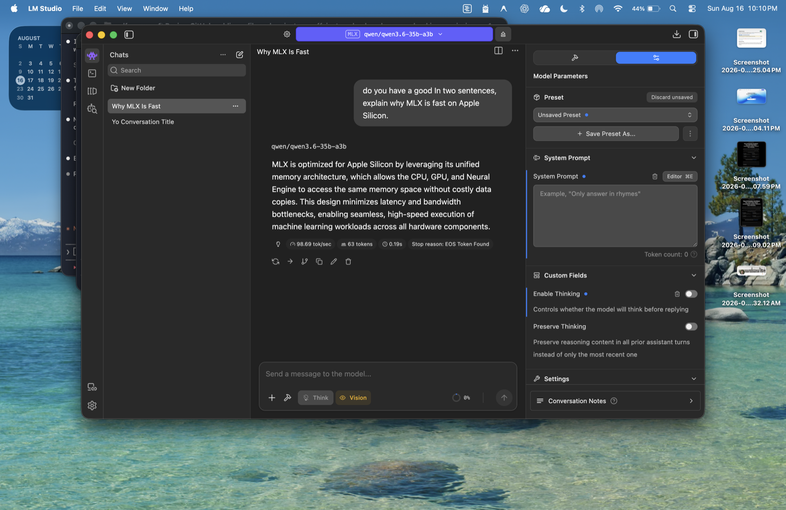
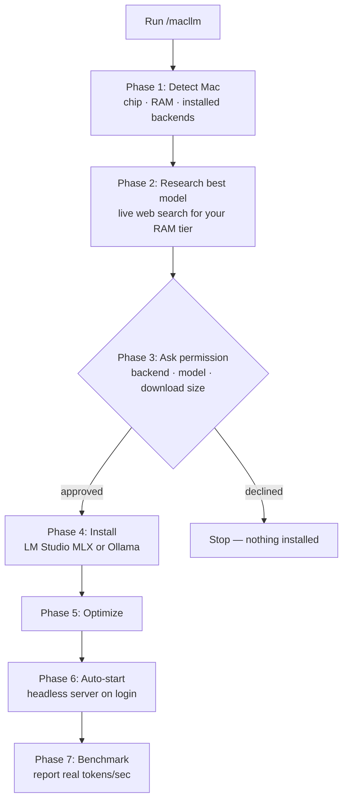
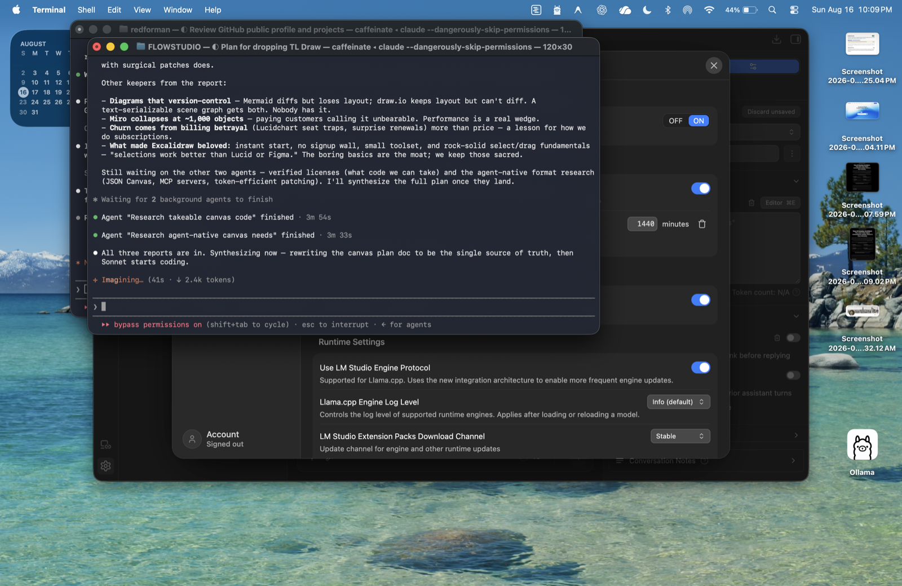

# macllm — Install & Optimize a Local LLM on your Mac (Apple Silicon)

**One command sets up a fast, private, offline AI model on your Mac.** `macllm` is
a [Claude Code](https://claude.com/claude-code) skill that detects your Apple
Silicon Mac (M1–M5), researches the best local LLM for your RAM *today*, installs
it, and applies every known Apple-Silicon speed optimization — MLX, 4-bit
quantization, thinking-off, keep-alive, and headless auto-start — then benchmarks
the result.

No subscription. No API keys. No data leaving your machine.



*A 35B model answering at ~99 tokens/sec on a 64 GB M5 Pro — MLX 4-bit, thinking off.*

---

## What is macllm?

macllm is a guided, permission-first installer and tuner for running large language
models locally on a Mac. Instead of guessing which model to download or how to make
it fast, the skill:

1. **Reads your Mac** — chip, RAM, macOS, and what's already installed.
2. **Researches the current best model** for your memory tier (rankings change every
   month, so it searches live rather than trusting a stale list).
3. **Asks before installing anything** — you approve the backend, the model, and the
   download size.
4. **Installs** via LM Studio (MLX, fastest on Apple Silicon) or Ollama.
5. **Optimizes** — the part most guides skip.
6. **Auto-starts** the model server so it's always ready.
7. **Benchmarks** and reports the real tokens/sec.

## Who is this for?

- Anyone who wants a **private, offline ChatGPT alternative** on a Mac.
- Developers wiring a **local model into an editor** (Continue, Cline) or scripts.
- People with **sensitive data** (legal, medical, financial) that shouldn't hit a cloud API.
- Anyone who downloaded a local model, found it **slow**, and wants it tuned properly.

---

## Quick start

> Requires [Claude Code](https://claude.com/claude-code) and an Apple Silicon Mac.

```bash
# 1. Add the skill to your Claude Code skills directory
git clone https://github.com/gwaghmar/macllm.git ~/.claude/skills/macllm

# 2. In Claude Code, run:
/macllm
```

Claude will profile your Mac, propose the best model, and walk you through the rest.

**Prefer to do it by hand?** The scripts work standalone:

```bash
bash scripts/detect-hardware.sh                       # profile your Mac
bash scripts/benchmark.sh lmstudio qwen/qwen3.6-35b-a3b   # measure tok/s
```

---

## How it works



### The optimization phase, in detail

Each of these reduces bytes-read-per-token or uses memory bandwidth better — the
two things that actually govern speed on a Mac.

```mermaid
flowchart LR
    subgraph Model choice
      M1[MoE, few active params] --> M2[4-bit quant] --> M3[MLX build]
    end
    subgraph Runtime
      R1[Thinking OFF by default] --> R2[Keep model loaded]
      R2 --> R3[Context length 16k]
      R3 --> R4[Flash attn + KV q8<br/>long context]
    end
    subgraph Verify
      V1[Speculative decoding?<br/>benchmark — keep only if it helps]
    end
    Model choice --> Runtime --> Verify
```

---

## Why local models are slow — and how macllm fixes it

On Apple Silicon there is one governing equation:

> **generation speed ≈ memory bandwidth ÷ bytes read per token**

Everything macllm does follows from it:

| Optimization | What it does | Why it's faster |
|---|---|---|
| **MoE model** (few active params) | Reads only the active experts per token | 10× fewer bytes than a dense model of the same total size |
| **4-bit quantization** | Compresses the weights | ~½ the bytes of 8-bit, ~2× the speed, negligible quality loss |
| **MLX runtime** | Apple's native ML framework | 10–30% faster than GGUF/llama.cpp on M-series |
| **Thinking off** | Skips the hidden reasoning monologue | Most of the *perceived* latency, gone |
| **Keep-alive** | Model stays in memory | Kills the 10–20 s cold-start reload |
| **Context 16k** | Right-sized KV cache | A bloated context window slows every token |

### What does NOT make it faster (myths this skill debunks)

- **"Use a smaller model."** On a Mac, a much smaller *dense* model often runs at the
  *same* tokens/sec as a good MoE — same bytes-per-token — while being far dumber.
  Shrink only to fit memory, never for speed.
- **"Speculative decoding always helps."** Sometimes 1.5–2×, often unsupported for
  MLX and worth exactly nothing. macllm benchmarks it and keeps it only if it helps.

---

## Best local LLM for your Mac (by RAM)

Rankings change monthly — the skill searches live — but as a rule of thumb:

| Mac RAM | Model class | Typical use |
|---|---|---|
| 8 GB | 3–4B dense, 4-bit | Basic chat, autocomplete |
| 16 GB | 7–9B dense, 4-bit | Solid everyday assistant |
| 24–32 GB | 27–32B dense or ~30B MoE, 4-bit | Strong reasoning, coding |
| 64 GB | ~35B MoE (few active), 4-bit MLX | Fast daily driver + private RAG |
| 128 GB+ | 70B dense or large MoE | Near-frontier local quality |

---

## Optimized, always-on setup

macllm enables LM Studio's headless server so your model is ready at
`http://localhost:1234/v1` the moment you log in — no app window required — and sets
the idle timeout high so it never reloads mid-session.



*Headless Local LLM Service on; model idle timeout raised to 24 hours.*

---

## Using your local model

Once installed, point any OpenAI-compatible tool at the local server:

| Backend | Base URL | Example model id |
|---|---|---|
| LM Studio | `http://localhost:1234/v1` | `qwen/qwen3.6-35b-a3b` |
| Ollama | `http://localhost:11434/v1` | `qwen3.6:35b-a3b` |

- **Chat UI:** open the LM Studio app and type, like ChatGPT.
- **In your editor:** point Continue or Cline at the base URL above.
- **Private document Q&A / RAG:** run [Open WebUI](https://docs.openwebui.com/) on
  top of the local server for a full ChatGPT-style interface with file upload.
- **Turn thinking off** for instant answers: send `"reasoning_effort": "none"` in the
  API request, or toggle the **Think** button off in the LM Studio chat.

---

## FAQ

### What is the best local LLM for a Mac in 2026?
It depends on your RAM. On 64 GB Apple Silicon, a ~35B mixture-of-experts model with
few active parameters, in a 4-bit MLX build, is the current sweet spot — near the
quality of much larger models at high speed. macllm searches for the current top pick
at install time, because the best model changes almost monthly.

### Is MLX faster than Ollama on a Mac?
Yes — Apple's MLX runtime is typically 10–30% faster than GGUF/llama.cpp on the same
model and hardware. In this project's own testing, an MLX 4-bit build ran ~30% faster
than the equivalent Ollama GGUF build (≈97 vs ≈74 tokens/sec on an M5 Pro).

### How do I make my local LLM faster on a Mac?
Use an MoE model, a 4-bit quant, and the MLX runtime; turn off "thinking" for everyday
use; keep the model loaded to avoid cold starts; and right-size the context window.
macllm applies all of these automatically. Beyond that, generation speed is capped by
your chip's memory bandwidth — only a higher-bandwidth Mac (e.g. Max/Ultra) goes faster.

### Do I need an internet connection to use it?
Only to download the model once. After that it runs fully offline — nothing you type
leaves your Mac.

### Is this private?
Yes. The model runs locally; prompts and responses never touch a cloud service.

### Does it work on Intel Macs?
The tunings target Apple Silicon (M1–M5), where MLX and unified memory apply. It will
detect a non-arm64 Mac and warn you.

---

## Requirements

- Apple Silicon Mac (M1 / M2 / M3 / M4 / M5), 8 GB RAM minimum (16 GB+ recommended)
- macOS 14+
- [Homebrew](https://brew.sh) (for one-line installs)
- [Claude Code](https://claude.com/claude-code) (to run the `/macllm` skill)

## Safety

macllm sets up models with their built-in safety training intact. It will help you
give a model a **blunt, no-filler personality** via a system prompt, but it will not
strip safety guardrails or fetch "uncensored" builds.

## License

MIT — see [LICENSE](LICENSE).

---

*Keywords: local LLM Mac, Apple Silicon LLM, MLX, LM Studio, Ollama, offline AI,
private ChatGPT alternative, run LLM locally, best local model M1 M2 M3 M4 M5,
optimize local LLM speed, macOS local AI, Claude Code skill.*
